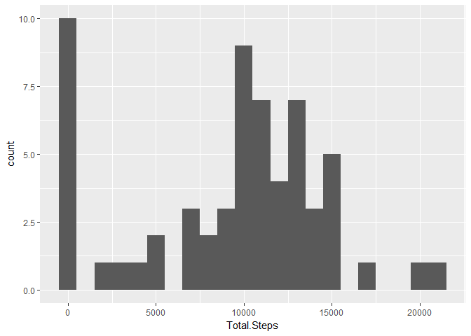
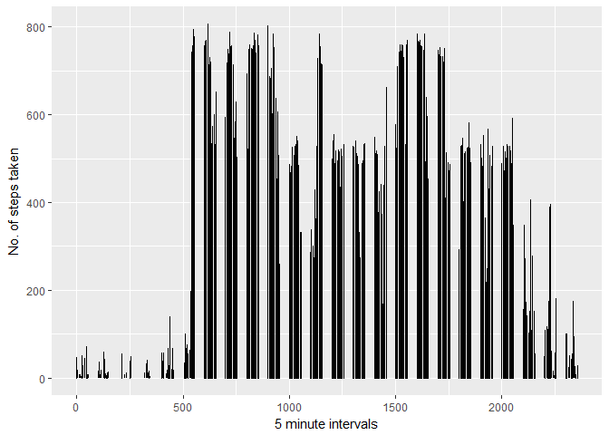
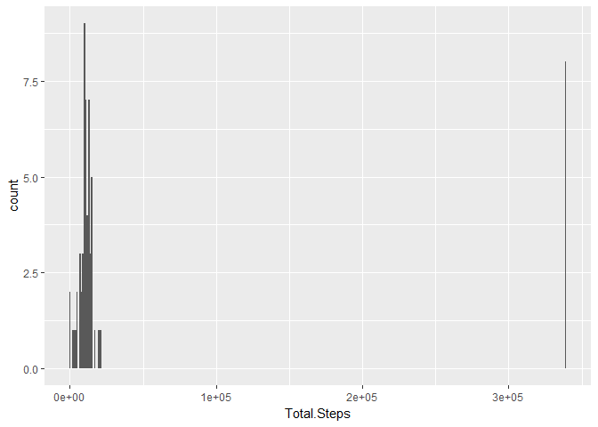
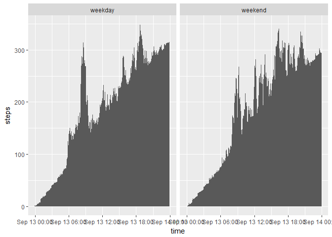

# Reproducible Research: Peer Assessment 1
Rachit Kinger  
13 September 2017  


## Loading and preprocessing the data
Load the data into the environment using the following code.  


```r
#download and load the raw data into the environment
URL <- "https://d396qusza40orc.cloudfront.net/repdata%2Fdata%2Factivity.zip"
if (!file.exists("activity.zip")){
      download.file(url = URL,
                    destfile = "activity.zip", method = "wget")}
unzip("activity.zip") 
activity <- read.csv("activity.csv") 
str(activity)
```

```
FALSE 'data.frame':	17568 obs. of  3 variables:
FALSE  $ steps   : int  NA NA NA NA NA NA NA NA NA NA ...
FALSE  $ date    : Factor w/ 61 levels "2012-10-01","2012-10-02",..: 1 1 1 1 1 1 1 1 1 1 ...
FALSE  $ interval: int  0 5 10 15 20 25 30 35 40 45 ...
```

To preprocess the data we need to convert date variable from a Factor variable into a Date format.  


```r
activity$date <- as.Date(activity$date, "%Y-%m-%d")
```

## What is mean total number of steps taken per day?
**What is the total number of steps taken each day?**  


```r
suppressPackageStartupMessages(library(dplyr))
suppressPackageStartupMessages(library(ggplot2))
activity <- tbl_df(activity)
dailySteps <- activity %>% 
    group_by(date) %>% 
    summarise(Total.Steps = sum(steps, na.rm = TRUE))
dailySteps
```

```
## # A tibble: 61 x 2
##          date Total.Steps
##        <date>       <int>
##  1 2012-10-01           0
##  2 2012-10-02         126
##  3 2012-10-03       11352
##  4 2012-10-04       12116
##  5 2012-10-05       13294
##  6 2012-10-06       15420
##  7 2012-10-07       11015
##  8 2012-10-08           0
##  9 2012-10-09       12811
## 10 2012-10-10        9900
## # ... with 51 more rows
```

**Make a histogram of total number of steps taken each day.**  

```r
ggplot(dailySteps, aes(Total.Steps)) + geom_histogram(binwidth = 1000) + stat_count()
```

<!-- -->
The above plot shows that (if we ignore the 0 steps days) the most common frequency is of 10,000 steps per day.   

**Calculate and report the mean and median total number of steps taken per day**  

```r
dailyMean <- mean(dailySteps$Total.Steps, na.rm = TRUE)
dailyMedian <- median(dailySteps$Total.Steps, na.rm = TRUE)
```

Mean number of steps: 9354.2295082  
Median: 10395  

## What is the average daily activity pattern?  
**Make a time series plot**  

```r
ggplot(activity, aes(x = interval, y = steps)) + 
    geom_line() + xlab("5 minute intervals") + ylab("No. of steps taken")
```

```
## Warning: Removed 2 rows containing missing values (geom_path).
```

<!-- -->

**Which 5-minute interval, on average across all the days in the dataset, contains the maximum number of steps?**


```r
topInterval <- 
    activity %>% 
    group_by(interval) %>% 
    summarise(Interval.Mean = mean(steps, na.rm = TRUE)) %>% 
    select(interval, Interval.Mean) %>% 
    arrange(desc(Interval.Mean)) %>% 
    top_n(1)
```

```
## Selecting by Interval.Mean
```

```r
topInterval
```

```
## # A tibble: 1 x 2
##   interval Interval.Mean
##      <int>         <dbl>
## 1      835      206.1698
```

The interval with highest mean across all days is: 835 and it's value is 206.1698113  

## Imputing missing values
**Calculate and report the total number of missing values in the dataset**  

```r
emptyCells <- sum(is.na(activity$steps))
```
Total number of intervals with missing values = 2304  

**Devise a strategy for filling in all of the missing values in the dataset**, and  
**Create a new dataset that is equal to the original dataset but with the missing data filled in**  
We will use the average value of the interval across the 60 days to impute the missing value in that interval.  

```r
#calculates mean value for each interval
intervalMeans <- activity %>% 
                    group_by(interval) %>% 
                    summarise(steps = mean(steps, na.rm = TRUE)) %>% 
                    select(interval, steps)

imputedValues <- left_join(activity[is.na(activity$steps),],
                           intervalMeans, 
                           by = "interval")
imputedValues$steps.y <- round(imputedValues$steps.y,0) #convert to discrete variable

activityNew <- activity #create a new dataset to apply imputed values to
activityNew[is.na(activityNew$steps), "steps"] <- imputedValues[,3] #copy the imputed values to missing values
```

**Make a histogram of the total number of steps taken each day**  


```r
dailyStepsNew <- activityNew %>% 
                    group_by(date) %>% 
                    summarise(Total.Steps = sum(steps, na.rm = TRUE))
ggplot(dailyStepsNew, aes(Total.Steps)) + geom_histogram(binwidth = 1000) + stat_count() #histogram of daily steps
```

<!-- -->

**Calculate and report the mean and median total number of steps taken per day. Do these values differ from the estimates from the first part of the assignment? What is the impact of imputing missing data on the estimates of the total daily number of steps?**  

```r
dailyMeanNew <- mean(dailyStepsNew$Total.Steps)
dailyMedianNew <- median(dailyStepsNew$Total.Steps)
```

The new mean is 5.3828984\times 10^{4}  
New median is 11458  

The median hasn't changed that much but dailyMeanNew has gone up significantly indicating that something is wrong with the imputing method.  

## Are there differences in activity patterns between weekdays and weekends?


```r
weekends <- activityNew$date
weekends <- weekdays(weekends) %in% c("Saturday", "Sunday")
activityNew <- transform(activityNew, week = ifelse(weekends ,'weekend', 'weekday'))
activityNew$week <- as.factor(activityNew$week)

IntervalByWeek <-
  aggregate(activityNew, list(interval = activityNew$interval, week = activityNew$week), mean)
IntervalByWeek$time <- formatC(IntervalByWeek$interval, width = 4, format = "d", flag = "0")
IntervalByWeek$time <- as.POSIXct(IntervalByWeek$time, format="%H%M")

g <- ggplot(IntervalByWeek, aes(x = time, y = steps))+
    geom_bar(stat = "identity") + 
    facet_wrap(~week, ncol=2)
g
```

<!-- -->
